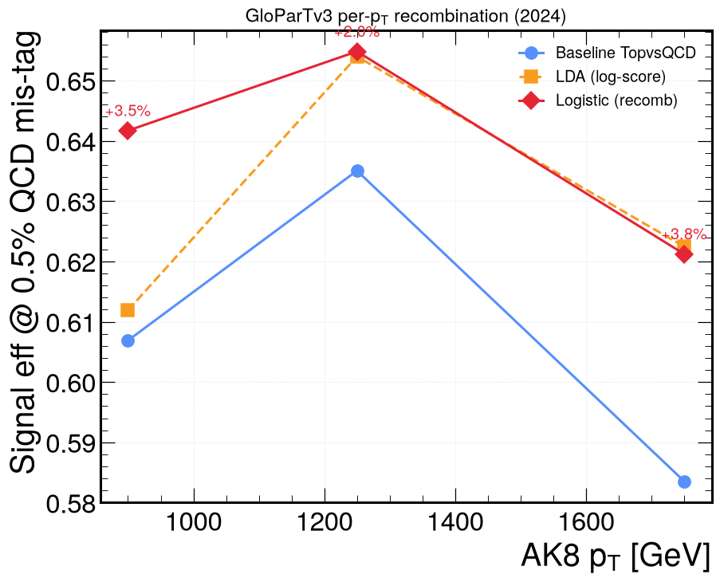
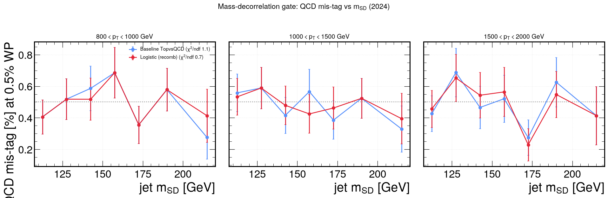

# GloParTv3 per-pT recombination — study verdict

Companion to `glopart_multiclass_recombination_plan.md`. Reproduce everything
with the local `.venv`:

```bash
.venv/bin/python -m unittest tests.test_glopart_recomb   # 22 tests
.venv/bin/python run_glopart_recomb.py                   # metrics + weights
.venv/bin/python plot_glopart_recomb.py                  # 3 figures
```

## Question

The baseline boosted-top tagger is the hand-built mass-decorrelated ratio
`TopvsQCD = (TopbWqq+TopbWq)/(TopbWqq+TopbWq+QCD)`. Its fixed 1:1
`TopbWqq:TopbWq` mix and QCD-only denominator are pT-independent choices. Can a
**learned, per-pT recombination** of the raw GloParTv3 class heads do better at a
fixed **0.5% QCD mis-tag**, *without* sculpting the QCD mass spectrum (the entry
ticket for 2DAlphabet)?

## Method

- **Inputs:** 7 raw heads `TopbWqq, TopbWq, QCD, Xqq, Xcs, Xbb, Xcc`.
  The mass-decorrelated heads are **not a softmax** (don't sum to 1; `Xqq` can
  exceed 1), so features are the **log-score `log(P+ε)`**, never the logit.
- **Three taggers per pT window:**
  - *baseline* — `TopvsQCD` (no fit; the target to beat).
  - *LDA* — Gaussian Fisher discriminant on the 7 log-scores, solved from
    accumulated moments (ntuple-free; cross-check).
  - *logistic* — class-balanced IRLS on a 9-D engineered log-score set (7 heads +
    `log(TopbWqq+TopbWq)` + `log(Xqq+Xcs+Xbb+Xcc)`); **primary fitter**.
- **No leakage:** event parity splits the data — parity 0 fits, held-out
  parity 1 gives every reported number.
- **Samples:** 2024 NanoAODv15. Each QCD pT window uses its own pT-binned skim
  (unit weights → concatenating pT bins would mix cross-sections); signal = all
  ZPrime→tt masses concatenated, sliced by pT (a matched boosted top is signal
  regardless of mediator mass). Local TTbar has too few boosted tops in the tail,
  hence the high-mass Z′.

## Results — signal eff @ 0.5% QCD mis-tag (held out)

| pT window (GeV) | Baseline | LDA | Logistic | Logistic − baseline |
|---|---|---|---|---|
| 800–1000  | 0.607 | 0.612 | **0.642** | +0.035 |
| 1000–1500 | 0.635 | 0.654 | **0.655** | +0.020 |
| 1500–2000 | 0.584 | 0.622 | **0.621** | +0.038 |

Mean logistic gain **+3.1%** absolute across the boosted tail. (Earlier full-file
check: pT 600–800 shows **no** gain — the baseline ratio is already near-optimal
there; LDA even loses from its Gaussian assumption.)

**Is the gain a statistical fluke? No.** Bootstrapping the held-out eval set
(400 resamples, taggers fixed) gives the gain at ~3–4σ *per window*:

| pT window (GeV) | gain | bootstrap σ | P(gain>0) |
|---|---|---|---|
| 800–1000 | +3.7% | 0.9% | 1.00 |
| 1000–1500 | +2.3% | 0.8% | 1.00 |
| 1500–2000 | +3.3% | 1.3% | 0.99 |

The error is set by the ~100 QCD jets in the 0.5% tail (not the ~20k total), so
the current local statistics are already sufficient for the **verdict**. More
statistics is needed only for *deployment* (below).

**Value of ntuples (logistic − LDA).** Since LDA is fit ntuple-free from moments
and logistic needs per-jet rows, their difference is exactly what ntuples buy:
**+3.0% at 800–1000**, **+0.1% at 1000–1500**, **~0 at 1500–2000**. So ntuples
matter only in the 800–1000 window; above 1 TeV the cheap moment-based LDA is
already optimal.



## Mass-decorrelation gate — PASS

At each tagger's own 0.5%-mis-tag working point, the QCD mis-tag is measured in
bins of jet `m_SD` and its flatness quantified (constant-fit χ²/ndf; smaller and
closer-to-baseline = the score does **not** carve the QCD mass peak):

| pT window (GeV) | Baseline χ²/ndf | Logistic χ²/ndf |
|---|---|---|
| 800–1000  | 1.1 | 0.7 |
| 1000–1500 | 0.6 | 0.2 |
| 1500–2000 | 1.1 | 1.3 |

Logistic is as flat as — or flatter than — baseline in every window, with
negligible slope. **The efficiency gain is not bought by sculpting QCD mass**, so
the recombined score is admissible for 2DAlphabet.



## Verdict — GO (boosted tail)

- Adopt a **per-pT logistic recombination for pT > 800 GeV**; keep the baseline
  ratio below that (no gain there). **Logistic is the primary fitter**; LDA is the
  ntuple-free cross-check.
- A custom score has no central top-tag SF → **float its SF in the ML / bump-hunt
  fit** (calibration cost is therefore not a blocker).

## Full-statistics path (coffea.casa) — for deployment weights

The local skims are enough for the *verdict*, but deployable per-pT weights need
the xs-weighted QCD mixture, finer pT bins, and the pT>2 TeV tail. Because the
winning method is **logistic** (needs per-jet rows, not just moments), the
processor has a skinny **ntuple mode** that stores ONLY the fit columns:

```bash
# 1) full-stats Dask run on coffea.casa -> one skinny npz per dataset
python run_toptag_wp.py --env casa --recomb-ntuple \
    --sample QCD --sample TTbar \
    --out outputs/toptag_wp_2024_recomb.coffea
#   (add resonance MC for the >1.5 TeV tail; TTbar runs dry on boosted tops there)

# 2) fit locally from the full-stats ntuples (finer pT bins as desired)
.venv/bin/python run_glopart_recomb.py \
    --ntuple-dir outputs/glopart_recomb/ntuples_2024 \
    --pt-edges 800 1000 1200 1500 2000 3000 \
    --out-dir outputs/glopart_recomb/full
```

The ntuple columns are the 7 heads + `pt, msd, mtt, weight, parity, label`
(`label` 1 = gen-matched top, 0 = inclusive QCD; weight = `xsec·lumi/sumw`). It
is tiny — even 50–100M jets is a few GB. The same Dask job can also emit the
moments (`--recomb`) for the ntuple-free LDA cross-check. The whole chain
(processor → npz → fit) is validated locally on the test files.

## Caveats / next

- Decorrelation here is vs **per-jet `m_SD`** (the 2DAlphabet per-jet mass axis).
  Flatness vs the **dijet `m_tt`** is not in these per-jet skims — check it on the
  full processor output before final adoption.
- Skims are **unweighted**; within-window shapes and tail efficiencies are robust
  to this, but absolute yields are not.
- Re-derive on the final QCD/TTbar central samples (not high-mass Z′) once the
  per-pT recomb is wired into `toptag_wp_processor.py` (`recomb_study=True`).

## Artifacts

- Library: `python/glopart_recomb.py` (+ `tests/test_glopart_recomb.py`, 22 tests)
- Driver / plots: `run_glopart_recomb.py`, `plot_glopart_recomb.py`
- Skims: `data/skim/skim_{QCD_PT*,ZPrime*}.npz`
- Outputs: `outputs/glopart_recomb/{recomb_metrics.json,logistic_weights.json,lda_weights.json}`
- Figures: `plots/images/glopart_recomb/`
